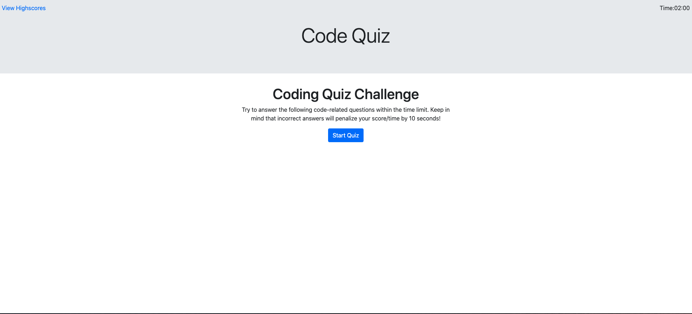
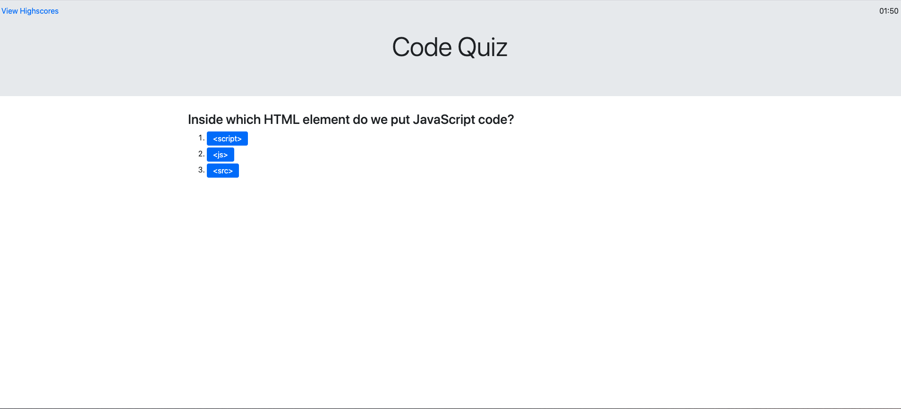
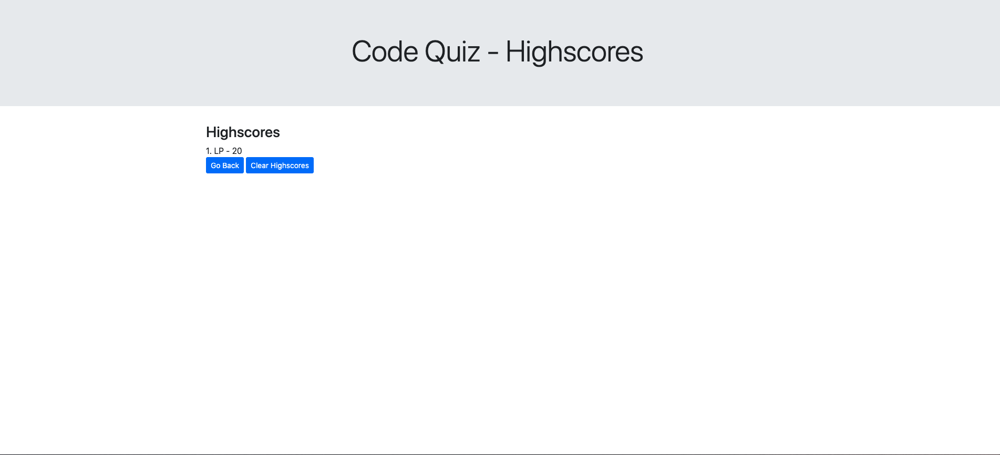

# code-quiz

## Links 
- link to the deployed application https://liza-p.github.io/code-quiz/


## Acceptance Criteria

```
GIVEN I am taking a code quiz
WHEN I click the start button
THEN a timer starts and I am presented with a question
WHEN I answer a question
THEN I am presented with another question
WHEN I answer a question incorrectly
THEN time is subtracted from the clock
WHEN all questions are answered or the timer reaches 0
THEN the game is over
WHEN the game is over
THEN I can save my initials and score
```
### To start the Quiz, click the "Start Quiz" button


### Once "Start Quiz" button clicked, multiple choice questions appear and the timer starts to count down


### When the quiz is completed, "All done!" screen appears with the player score


### Player can save their score and view it on the View Highscore page

